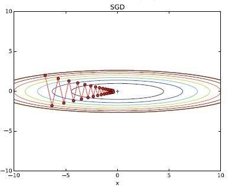
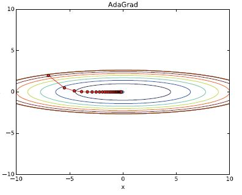

### 학습 관련 기술들 ###


- 가중치 매개변수의 최적값을 탐색하는 최적화 방법
- 가중치 매개변수 초깃값, 하이퍼파라미터 설정 방법
- 오버피팅의 대응책인 가중치 감소와 드롭아웃 등 정규화 방법
- 배치 정규화


#### 6.1 매개변수 갱신

- **신경망 학습 목적** : 손실 함수의 값을 가능한 한 낮추는 매개변수를 찾는 것 = 최적의 매개변수를 찾는 것 -> **최적화**

    그러나, 매개변수 공간은 매우 넓고 복잡해서 최적의 솔루션을 쉽게 찾기 어렵다. 

  ​	-> 수학의 수식을 푸는 것과 같이 최소값을 구하는 방법은 없다.

- **확률적 경사하강법** : 지금까지 최적의 매개변수 값을 찾기 위해 **매개변수의 기울기(미분)을 이용**했다.

  -  매개변수의 기울기를 구하고, 기울어진 방향으로 매개변수 값을 갱신하는 일을 반복하여 점점 최적의 매개변수로 다가간다.


##### 6.1.2 확률적 경사 하강법(SGD)

- 손실함수의 기울기를 계산 -> 기울기 값에 학습률을 계산 -> 이 결과 값으로 기존의 가중치 값을 갱신


​				W : 갱신할 가중치 매개변수

​				∂L/∂W : W에 대한 손실 함수의 기울기

​				η : 학습률

​				← : 우변의 값으로 좌변의 값을 갱신한다. 

```python
class SGD:
    # lr : 학습률
    def __init__(self, lr = 0.01):
        self.lr = lr
        
    # params : 가중치
    # grads : 기울기
    def update(self, params, grads):
        for key in params.keys():
            params[key] -= self.lr * grads[key]

network = TwoLayerNet(...)
# 최적화, 경사하강법, 매개변수 갱신
optimizer = SGD()

for i in range(10000):
    ...
    # 미니배치
    x_batch, t_batch = get_mini_batch(...)
    grads = network.gradient(x_batch, t_batch)
    params = network.params
    optimizer.update(params, grads)
    ...
```


##### 6.1.3 확률적 경사 하강법의 단점

- 문제에 따라 비효율적일 때가 있다.
- 무작정 기울어진 방향으로 이동 -> 탐색 경로가 비효율적 -> 탐색 시간이 증가.
- 예 ) 다음 함수 최적화


위 수식은 왼쪽과 같이 밥그릇을 x축 방향으로 늘인 듯한 모습, 실제로 등고선은 오른쪽과 같이 x축 방향으로 늘인 타원형이다. 

기울기는 y축 방향으로 크고 x축 방향으로는 작다. (화살표 길이) => y축 방향으로는 가파른데 x축 방향은 완만하다. 실제 최소값이 되는 장소는 (x,y) = (0,0)  이지만, 기울기 대부분은 (0,0) 방향을 가리키지 않는다.


- 위 함수에 SGD 적용. 탐색을 시작하는 장소(초깃값)은 (x,y) = (-7.0, 2.0)



**심하게 굽이진 움직임**을 보인다. -> **비효율적인 움직임**


즉, SGD의 단점은 **비등방성 함수**에서는 탐색 경로가 비효율적이라는 것. -> 최소값의 방향으로만 움직이기 때문에 본래의 최저점으로 기울기의 방향이 좀처럼 향하지 않게되고 다른 방향을 가리키게 된다.

*비등방성 함수 : 방향에 따라 성질, 즉 여기서는 기울기가 달라지는 함수*


##### 6.1.4 SGD 대체1. 모멘텀

**모멘텀** : =운동량. 물리와 관계가 있다. 기울기에 속도 개념이 추가된 것.

 		-> 지상의 마찰력 때문에 물체의 이동 속도가 점점 감소한다.

​		-> 속도가 크게 나올수록 기울기가 크게 업데이트


​						v : 속도

​						αv : 물체가 아무런 힘을 받지 않을 때 서서히 하강 시키는 역할을 한다. 물리에서는

​							지면 마찰이나 공기 저항에 해당. α는 0.9등 의 값으로 설정

​							-> 기울기가 갱신되는 폭을 조절한다. 

기울기 방향으로 힘을 받아 물제가 가속된다는 물리 법칙을 나타낸다. 


```python
class Momentum:
    def __init__(self, lr=0.01, momentum=0.9):
        self.lr = lr
        self.momentum = momentum
        self.v = None
        
    def update(self, params, grads):
        # update가 처음 호출될 때 v에 매개변수와 같은 구조의 데이터를 딕셔너리 변수로 저장.
        if self.v is None:
            self.v = {}
            for key, val in params.items():
                self.v[key] = np.zeros_like(val)
                
        for key in params.keys():
            self.v[key] = self.momentum * self.v[key] - self.lr * grads[key]
            params[key] += self.v[key]
```


모멘텀 갱신 경로는 공이 그릇 바닥을 구르듯 움직인다. SGD에 비해 **지그재그 정도가 덜하다.**

**x축의 힘은 아주 작지만** 방향은 변하지 않아서 **한 방향으로 일정하게 가속**하기 때문.

거꾸로 **y축의 힘은 크지만** 위아래로 번갈아 받아서 상충하여 **y축 방향의 속도는 안정적이지 않다.**

전체적으로 **x축 방향으로 빠르게 다가가** 지그재그 움직임을 줄일 수 있다.


##### 6.1.5 SGD 대체2. AdaGrad

- 신경망 학습에서는 **학습률**이 가장 중요하다. 
  - 이 값이 너무 작으면 -> 학습 시간이 길어진다. (보폭이 작아 많은 걸음을 걸어야 한다.)
  - 반대로 너무 크면 -> 올바른 학습을 할 수 없다. 
  - **학습률** = **보폭** : 한번 갱신하는 가중치 값의 양을 결정한다. 
- 학습률을 정하는 효과적인 기술 **확률적 감소** : 학습을 진행하면서 학습률을 점차 줄여가는 방법. 처음에는 크게 학습하다가 조금씩 작게 학습한다.
- **학습률을 서서히 낮추는** 가장 간단한 **방법** : **매개변수 '전체'의 학습률 값을 일괄적으로 낮춘다.**  이를 더더욱 **발전시킨 것**이 **AdaGrad** -> '각각의' 매개변수에 '맞춤형' 값을 만들어준다.
- 개별 매개변수에 적응적으로 학습률을 조정하면서 학습을 진행한다. 
  - 과거의 기울기를 제곱하여 계속 더해간다. 그래서 학습을 진행 할 수록 갱신 강도가 약해진다. 무한히 계속 학습한다면 어느 순간 갱신량이 0이 되어 전혀 갱신되지 않는다. 이 문제를 개선한 기법이 **RMSProp**
  - **RMSProp** : 과거 모든 기울기를 균일하게 더해가는 것이 아니라, 먼 과거의 기울기는 거거히 잊고 새로운 기울기 정보를 크게 반영한다.(**지수이동평균**)
- 갱신 방법 수식


​							h : 기존 기울기 값을 제곱하여 계속 더해준다. ( Θ : 행렬의 원소별 곱셈 )

매개변수를 갱신할 때 학습률을 조정한다. -> 매개변수의 원소 중에서 많이 움직인(크게 갱신된) 원소는 학습률이 낮아진다는 뜻. -> 학습률 감소가 매개변수의 원소마다 다르게 적용된다. 


```python
class AdaGrad:
    def __init__(self, lr = 0.01):
        self.lr = lr
        self.h = None
        
    def update(self, params, grads):
        if self.h is None:
            self.h = {}
        	for key, val in params.items():
            	self.h[key] = np.zeros_like(val)
        
        for key in params.keys():
            self.h[key] += grads[key] * grads[key]
            # 1e-7 을 더해줌으로써 self.h[key]에 0이 담겨있다해도 0으로 나누는 사태를 막는다.
            params[key] -= self.lr * grads[key] / (np.sqrt(self.h[key]) + 1e-7 )
```



최솟값을 향해 효율적으로 움직인다. y축 방향은 기울기가 커서 처음에는 크게 움직이지만, 그 큰 움직임에 비례해 갱신 정도도 큰 폭으로 작아지도록 조정. -> y축 방향으로 갱신 강도가 약해졌고, 지그재그 움직임이 줄어들엇다.


##### 6.1.6 Adam

- 모멘텀 : 공이 구르는 듯한 물리 법칙에 따르는 움직임
- AdaGrad : 매개변수의 원소마다 적응적으로 갱신 정도를 조정
- Adam : 위 두 기법을 융함한 것.
- 하이퍼파라미터의 '편향 보정'이 진행된다는 점이 특징. 하이퍼파라미터가 많다. 
- 학습률을 줄여나가고 속도를 계산하여 학습의 갱신강도를 적응적으로 조정해나간다.


갱신 과정이 공이 구르는 듯한 움직임을 보인다. 모멘텀때 보다 좌우 흔들림이 적다. 


##### 6.1.7 어느 갱신 방법을 이용할 것인가?

- 풀어야 할 문제, 파이퍼파라미터를 어떻게 설정하느냐에 따라 달라진다.
- 모든 문제에서 항상 뛰어난 기법은 없다. 


##### 6.2.8 MNIST 데이터셋으로 본 갱신 방법 비교

- 각 층이 100개의 뉴런으로 구성된 5층 신경망에서 ReLu를 활성화 함수로 사용해 측정


- SGD 학습 진도가 가장 느리다.
- AdaGrad가 학습 진도가 다른 세가지 보다 조금 더 빠르다.
- SGD 보다 다른 세 기법이 때로는 최종 정확도도 높게 나타난다.


---------------

#### 6.2 가중치의 초깃값


